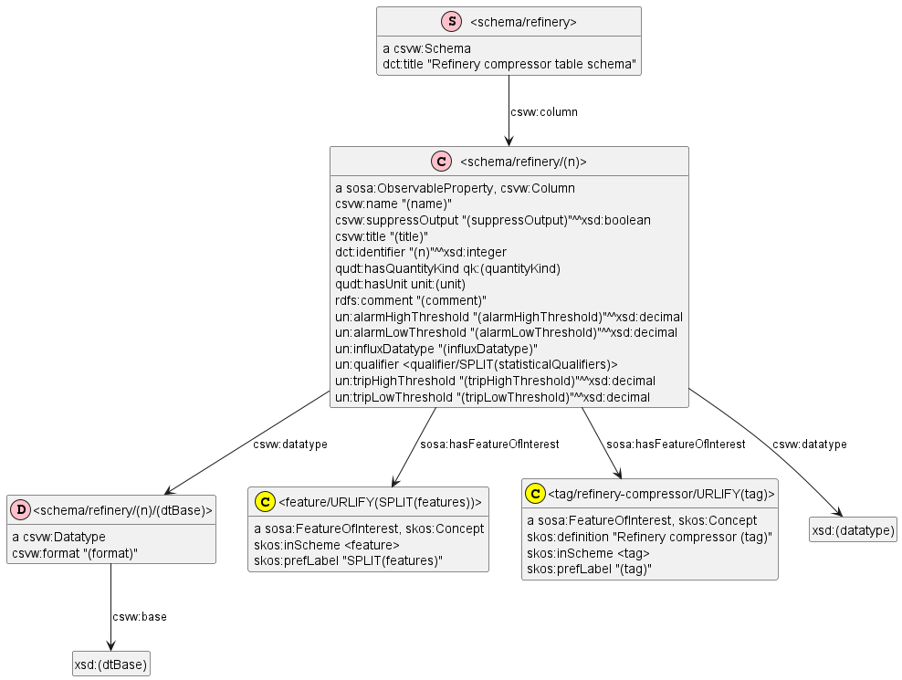

# UNDERPIN Semantic Model

UNDERPIN is a manufacturing dataspace that covers sensor data and predictive maintenance analytics for energy: the oil and gas (refineries) and wind farms.

## Contents
<!-- markdown-toc start - Don't edit this section. Run M-x markdown-toc-refresh-toc -->
**Table of Contents**

- [UNDERPIN Semantic Model](#underpin-semantic-model)
    - [Contents](#contents)
    - [Glossary](#glossary)
    - [Preliminary Materials](#preliminary-materials)
- [Reference Ontologies](#reference-ontologies)
    - [Dataspace Protocol](#dataspace-protocol)
    - [DCAT](#dcat)
    - [CSVW](#csvw)
    - [QUDT](#qudt)
    - [QB](#qb)
    - [SDMX for Common Properties](#sdmx-for-common-properties)
    - [Statistical Qualifiers](#statistical-qualifiers)
    - [PROV](#prov)
    - [SSN/SOSA](#ssnsosa)
    - [Wind Turbine Ontologies](#wind-turbine-ontologies)
- [UNDERPIN Data Organization](#underpin-data-organization)
- [UNDERPIN Data Model](#underpin-data-model)
    - [UNDERPIN Prefixes](#underpin-prefixes)
    - [UNDERPIN Thesauri](#underpin-thesauri)
        - [UNDERPIN Statistical Qualifiers](#underpin-statistical-qualifiers)
        - [UNDERPIN Units and Quantity Kinds](#underpin-units-and-quantity-kinds)
        - [UNDERPIN Features of Interest](#underpin-features-of-interest)
    - [Dataset Model](#dataset-model)
    - [Table Schema Model](#table-schema-model)

<!-- markdown-toc end -->

## Glossary

- CSV: Comma-Separated Values
- CSVW: CSV on the Web ontology model and processing specification
- DCAT: Data Catalog ontology
- DSP: DataSpace Protocol
- EDC/Sovity: a version of EDC extended by Sovity: the dataspace implementation used by the project
- EDC: Eclipse Dataspace Components
- Influx: a popular timeseries database
- PROV: Provenance ontology
- QUDT: Quantities, Units and Datatypes ontology

## Preliminary Materials
The following preliminary materials are avalable in subfolders:
- [dcat](dcat): some info about DCAT, a descriptive example of a `dcat:Dataset`, and describes issues with the DCAT JSON emitted by EDC
- [use-cases/refinery](use-cases/refinery): shows a representation of sensor data and events as the CUBE ontology.
  Later we decided that we'll use Influx to store sensor data, and use RDF only to describe it.
  But some of the property definitions are still relevant.
- [use-cases/wind-farm](use-cases/wind-farm): shows a description of sensor data as CSVW, and describes that standard and related resources.

# Reference Ontologies

This section describes reference ontologies used by UNDERPIN.
Local copies are saved in folder [reference-ontologies](reference-ontologies):
- csvw.ttl
- dcat3.ttl
- prov.ttl
- quantity-kinds.ttl
- qudt.ttl
- ReliaWind.ttl
- sosa.ttl
- ssn.ttl
- units.ttl

## Dataspace Protocol

The [IDSA Dataspace Protocol](https://docs.internationaldataspaces.org/ids-knowledgebase/dataspace-protocol) (DSP) specifies dataspace metadata exchanges.
- We mostly focus on the [ACK - Catalog](https://docs.internationaldataspaces.org/ids-knowledgebase/dataspace-protocol/catalog/catalog.protocol#id-3.1-ack-catalog) message
- It is based on DCAT for describing datasets and ODRL for describing rights and obligations
- We limit our consideration to `Dataset, Distribution` and `DataService`; and ignore `dcat:Catalog` and ODRL classes, since these are managed by the dataspace
- DSP limits DCAT as shown on the following figure.
- EDC limits DCAT further
  (see [Semantic Problems in Dataspaces](https://docs.google.com/document/d/1njouSHxpt_jaJ-g0oMeBQr3knDxn2EYfaRtr9LcZBZE/edit?tab=t.0#heading=h.qjjuypvgehnx), [AIOTI Workshop on Semantic Interoperability for Digital Twins](https://www.ercim.eu/events/aioti-workshop-on-semantic-interoperability-for-digital-twins), 5-6 February 2025, Sophia Antipolis, France).
  We mostly comply with the restrictions, with some exceptions as noted below. For example:
  - A `Dataset` can have only one `Distribution`. We keep to this restriction.
  - Extra classes like `DatasetSeries` and ontologies like CSVW are not supported. We work around this restriction.

The following image shows the classes and properties used by the DSP.


Note: this image is available at the following URLs:
- [Github](https://raw.githubusercontent.com/International-Data-Spaces-Association/ids-specification/refs/heads/main/catalog/message/diagram/catalog.png) as source
- [Gitbook](https://docs.internationaldataspaces.org/~gitbook/image?url=https%3A%2F%2F377581754-files.gitbook.io%2F%7E%2Ffiles%2Fv0%2Fb%2Fgitbook-x-prod.appspot.com%2Fo%2Fspaces%252FlnGZQUB3A7aTQkUjaEA4%252Fuploads%252Fgit-blob-767c346281d167b081ef76d59536a19e7707df58%252Fcatalog.png%3Falt%3Dmedia&width=300&dpr=4&quality=100&sign=5be1871&sv=2) as deployed

## DCAT
The W3C [Dataset Catalog (DCAT) ontology](https://www.w3.org/TR/vocab-dcat-3/) is the prevalent ontology for dataset metadata.
It is well established: it is mature (has been in development since 2014 and the current version is 3)
and is the foundation of numerous data portals and other data sharing initiatives,
in particular the [European Data Portal](https://data.europa.eu/en).
Various DCAT profiles have been created:
for EU datasets (DCAT-AP), statistics ([StatDCAT-AP](https://interoperable-europe.ec.europa.eu/collection/semic-support-centre/solution/statdcat-application-profile-data-portals-europe)), geospatial ([GeoDCAT-AP](https://semiceu.github.io/GeoDCAT-AP/drafts/latest/)), life sciences ([HCLS Dataset](https://www.w3.org/TR/hcls-dataset/)), national (DE, NO, DK, SE, IT),
Dataspaces, etc.

This [Figure 1](https://www.w3.org/TR/vocab-dcat-3/#fig-dcat-all-attributes) from the DCAT spec is an overview,
showing the classes of resources that can be members of a Catalog, and the relationships between them.


## CSVW
CSW on the Web (CSVW) is a W3C standard for describing CSV sheets in a machine-readable way.
We use it to describe dataset **columns**.

CSVW resources (all W3C specs are Editor's Draft 02 November 2022 unless otherwise indicated):
- https://csvw.org/: This site explains CSVW and suggests tools one can use for working with it
- https://w3c.github.io/csvw/primer : CSV on the Web: A Primer
- https://w3c.github.io/csvw/metadata/ : Metadata Vocabulary for Tabular Data
- https://www.rfc-editor.org/rfc/rfc6570 : URL Templates as used in CSVW
- https://w3c.github.io/csvw/syntax/ : Model for Tabular Data and Metadata on the Web
- https://w3c.github.io/csvw/csv2rdf/ : Generating RDF from Tabular Data on the Web
- https://w3c.github.io/csvw/ns/ : CSVW Namespace Vocabulary Terms (06 June 2017)

The following diagram shows the properties of different CSVW descriptors (from [CSVW Metadata Format](https://w3c.github.io/csvw/metadata/#metadata-format)):


## QUDT

Quantitites, Units and Datatypes (QUDT) is a popular ontology of
quantity kinds (eg Linear Velocity),
units of measure (eg Meters per Second),
system of units (eg SI),
conversion factors, etc.

Using a standard ontology for units has multiple benefits, including
precision, non-ambiguity, ability to convert and compare quantities between units.
Here are some examples of mapping CSV metadata to QUDT:

| CSV kind          | CSV unit | `quantityKind:` | `unit:`                | Note                                                                                        |
|-------------------|----------|-----------------|------------------------|---------------------------------------------------------------------------------------------|
| Vibration         | micron   | Distance        | `MicroM`               | "Vibration" is expressed as feature of interest                                             |
| AxialDisplacement | mm       | Displacement    | `MilliM`               | "Axial" is expressed as feature of interest                                                 |
| Pressure          | kg/cm2   | Pressure        | `KiloGM_F-PER-CentiM2` | "kg/cm2" is not a proper Pressure unit, actually "kg-force/cm2" is meant (same as next row) |
| Pressure          | Kgf/cm2  | Pressure        | `KiloGM_F-PER-CentiM2` |                                                                                             |
|                   | rpm      | AngularVelocity | `REV-PER-MIN`          |                                                                                             |
| Flow              | Kg/h     | MassFlowRate    | `KiloGM-PER-HR`        |                                                                                             |

We use subsets of these two resources:
- `qudt:QuantityKind` (namespace `qk:` https://qudt.org/vocab/quantitykind/ ): 1152
- `qudt:Unit` (namespace `unit:` https://qudt.org/vocab/unit/ ) : 2532

There is a many-to-many correlation between units and quantity kinds. For example:
- `unit:A` (ampere) can be used for `CurrentLinkage, DisplacementCurrent, ElectricCurrent, ElectricCurrentPhasor, MagneticTension, MagnetomotiveForce, TotalCurrent`
- `qk:ElectricCurrent` can be measured in `A, A_Ab, A_Stat, AttoA, BIOT, FemtoA, GigaA, KiloA, MegaA, MicroA, MilliA, NanoA, PetaA, PicoA, PlanckCurrent, TeraA`

Because these are huge lists of resources and the dataspace user would be confused if they have to select from such large lists,
we subset them to only units that we have encountered.

## QB

The W3C Data Cube (QB) ontology is used for representing observations and statistical data.
It captures multidimensional observations (data cubes) using the following terminology:
- `qb:dimension`: independent variable/column.
  Potentially every combination of dimension values can carry an observation.
- `qb:measure`: dependent variable/column, a numerical value
- `qb:attribute`: unit of measure or qualifier such as context, precision, method of measurement
- `qb:Observation`: a data point that includes all specified dimensions and all or most measures
- `qb:DataSet`: a set of observations, i.e. a data Cube
- `qb:DataStructureDefinition`: defines what components (dimensions, measures and attributes)
  apply to a certain cube

QB would be very appropriate for UNDERPIN if we aimed to capture sensor data as RDF.
- See [BigDataGrapes Semantic Model section 2.4 Data Structure Definition](https://github.com/BigDataGrapes-EU/ontology/blob/master/model/README.org#24-data-structure-definition)
  for an older research project where we used QB extensively
- See a small example in the subfolder [use-cases/refinery](use-cases/refinery) here
- But since we only **describe** sensor data in RDF (whereas we use CSV or Influx to keep it), CSVW is sufficient
- Some CSVW representations also use QB to delineate between `dimensions` and `measures`, but we don't use it

## SDMX for Common Properties

Statistical Data and Metadata eXchange ([SDMX](https://sdmx.org/))
is an ISO standard designed to describe statistical data and metadata, normalise their exchange,
and improve their efficient sharing across statistical and similar organisations.

SDMX has been translated to RDF, and we use the [SDMX Content Oriented Guidelines concept scheme](http://purl.org/linked-data/sdmx/2009/concept)
(with prefix `sdmx-concept:`) to express some specific info needed for Influx:
- Which is the timestamp column
- Which column (if any) is the machine or wind turbine tag

We use these two concepts:
```ttl
sdmx-concept:refPeriod a sdmx:Concept, skos:Concept ;
  rdfs:label "Reference Period"@en ;
  rdfs:comment "The period of time or point in time to which the measured observation is intended to refer." ;
  rdfs:isDefinedBy <https://sdmx.org/wp-content/uploads/01_sdmx_cog_annex_1_cdc_2009.pdf> ;
  skos:notation "urn:sdmx:org.sdmx.infomodel.conceptscheme.Concept=SDMX:CROSS_DOMAIN_CONCEPTS[1.0].REF_PERIOD";
  skos:inScheme sdmx-concept:cog .

sdmx-concept:refArea a sdmx:Concept, skos:Concept ;
  rdfs:label "Reference Area"@en ;
  rdfs:comment "The country or geographic area to which the measured statistical phenomenon relates." ;
  rdfs:isDefinedBy <https://sdmx.org/wp-content/uploads/01_sdmx_cog_annex_1_cdc_2009.pdf> ;
  skos:notation "urn:sdmx:org.sdmx.infomodel.conceptscheme.Concept=SDMX:CROSS_DOMAIN_CONCEPTS[1.0].REF_AREA";
  skos:inScheme sdmx-concept:cog .
```

We could annotate Underpin properties like this.
But for now we use `csvw:Column` instead of RDF properties, so we don't use such annotations.
```ttl
un:dateTime a owl:DatatypeProperty, qb:DimensionProperty;
  rdfs:label "Date-time";
  rdfs:range xsd:dateTime;
  qb:concept sdmx-concept:refPeriod.

un:machineCode a owl:DatatypeProperty, qb:DimensionProperty;
  rdfs:label "Machine code";
  rdfs:range xsd:string;
  qb:concept sdmx-concept:refArea.
```

## Statistical Qualifiers

Some of the columns have statistical qualifiers such as average, min, max, 5% percentile, 95% percentile, etc.

We have searched for ontologies that include such terms.
The [BigDataGrapes Semantic Model section 1.2.2 Statistical Operations](https://github.com/BigDataGrapes-EU/ontology/blob/master/model/README.org#122-todo-statistical-operations)
researched 12 ontologies (using the example qualifier "standard deviation"):
- SemanticScience Integrated Ontology (SIO)
- Ontology for Biomedical Investigations (OBI)
- Smart Energy Aware Systems (SEAS)
- Smart Appliances Reference Ontology (SAREF) extension for EEBus and Energy@Home (S4EE)
- Earth, Life and Semantic Web (ELSeWeb) project
- MEX Performance ontology for performance metrics of machine learning algorithms
- DATEX EU standard for exchange of traffic related data

In addition we looked at
- The [QB4OLAP](https://github.com/lorenae/qb4olap/blob/master/rdf/qb4olap.ttl) ontology that extends QB to represent OLAP cubes
  and to implement OLAP operators (such as Roll-up, Slice, and Dice).
  It can represent functions that are applied to compute aggregate values of measures.
  A few aggregate functions are defined: `Avg, Count, Min, Max, Sum`.

Since we need more aggregates, we used our own taxonomy rather than reusing one of these

## PROV
Provenance is information about entities, activities, and agents involved in producing a piece of data or thing, which can be used to form assessments about its quality, reliability or trustworthiness.
PROV defines a model, ontology, corresponding serializations and other supporting definitions to enable the inter-operable interchange of provenance information on the Web.

PROV is described in the following documents:
- [PROV-OVERVIEW](https://www.w3.org/TR/2013/NOTE-prov-overview-20130430/) (Note), an overview of the PROV family of documents
- [PROV-PRIMER](https://www.w3.org/TR/2013/NOTE-prov-primer-20130430/) (Note), a primer for the PROV data model
- [PROV-O](https://www.w3.org/TR/2013/REC-prov-o-20130430/) (Recommendation), the PROV ontology, an OWL2 ontology allowing the mapping of the PROV data model to RDF
- [PROV-DM](https://www.w3.org/TR/2013/REC-prov-dm-20130430/) (Recommendation), the PROV data model for provenance
- [PROV-N](https://www.w3.org/TR/2013/REC-prov-n-20130430/) (Recommendation), a notation for provenance aimed at human consumption
- [PROV-CONSTRAINTS](https://www.w3.org/TR/2013/REC-prov-constraints-20130430/) (Recommendation), a set of constraints applying to the PROV data model
- [PROV-XML](https://www.w3.org/TR/2013/NOTE-prov-xml-20130430/) (Note), an XML schema for the PROV data model
- [PROV-AQ](https://www.w3.org/TR/2013/NOTE-prov-aq-20130430/) (Note), mechanisms for accessing and querying provenance
- [PROV-DICTIONARY](https://www.w3.org/TR/2013/NOTE-prov-dictionary-20130430/) (Note) introduces a specific type of collection, consisting of key-entity pairs
- [PROV-DC](https://www.w3.org/TR/2013/NOTE-prov-dc-20130430/) (Note) provides a mapping between PROV-O and Dublin Core Terms
- [PROV-SEM](https://www.w3.org/TR/2013/NOTE-prov-sem-20130430/) (Note), a declarative specification in terms of first-order logic of the PROV data model
- [PROV-LINKS](https://www.w3.org/TR/2013/NOTE-prov-links-20130430/) (Note) introduces a mechanism to link across provenance bundles

We use in particular the following [PROV-O](http://www.w3.org/TR/prov-o/) properties:
- `prov:wasDerivedFrom`
  - Definition: A derivation is a transformation of an entity into another,
    an update of an entity resulting in a new one,
    or the construction of a new entity based on a pre-existing entity.
  - We use it to link a resulting dataset (predictions) to the input dataset (actual values).
- `prov:wasRevisionOf`
  - Definition: A revision is a derivation for which the resulting entity is a revised version of some original.
    The implication here is that the resulting entity contains substantial content from the original.
    Revision is a particular case of derivation.
  - We could use it to link `dcat:DatasetSeries` to the individual `dcat:Datasets` it is comprised of.
    But there is the inverse link `dcat:inSeries` (from `Dataset` to `DatasetSeries`)

## SSN/SOSA

TODO

We use it for:
- Some modest sensor descriptions
- To capture the features of interest (`sosa:hasFeatureOfInterest`) of a column

## Wind Turbine Ontologies

We don't have access to the detailed structure of the MOH Refinery.
So we describe a few parts that the data relates to (compressor, steam turbine, bearing, etc),
but don't describe their hierarchy.

On the other hand, wind turbine structure is pretty standard, so we searched for ontologies and taxonomies that describe wind turbine components.

ISO 81346 Reference Data System is a standard for systematically describing the breakdown and structure of a complex plant.
ISO 81346-10 RDS for Power Systems includes specific terms for describing power plants and wind farms.
[This example](https://static1.squarespace.com/static/621c9f78c59da237abfc2b84/t/62ff688f47e07d1ae653c893/1660905618110/RDS-PS+Wind+Farm+Example.pdf) of a Wind Farm and Wind Turbine Generator from the [81346.com](https://www.81346.com/) site shows the comprehensive breakdown (see below).
However, we decided not to use RDS because there is no openly available machine-readable resource,
and the identifiers are not readable (eg `=AE.=JF.=KJ` designates "Cover system> Drive train system> Main bearing system")


The [Open Energy Ontology](https://openenergyplatform.org/viewer/oeo/)
- Includes some relevant classes such as
  - `OEO_00000447` wind farm
  - `OEO_00010361` renewable power unit
- And even `OEOX_00010002` wind turbine space requirement
- However, it doesn't go into components, e.g. gearbox, bearing.


[Linked Open Vocabularies](https://lov.linkeddata.es/dataset/lov/terms?q=%22wind%20turbine%22) seems to have 1 ontology about wind farms:
- [Wind Farm Ontology](https://w3id.org/wfont) (WFOnt), derived from SANDIA Report SAND2009-1171 and the DAEKIN project.
  It has 52 classes (though some should be individuals, eg Unclassified Wear Level), including structural parts and wear types.

The [TechnoPortal](https://technoportal.hevs.ch/ontologies) ontology portal has 5 ontologies/taxonomies related to wind turbines:
- [RELIEATAX](https://technoportal.hevs.ch/ontologies/RELIEATAX/): RELIAWIND Wind Turbine Component Taxonomy.
  A taxonomical organization of wind turbine compenents used within the RELIAWIND project.
  Has 334 concepts.
- FMECA Ontology for Wind Turbines (FMECA4WT).
  Failure Mode, Effects and Criticality Analysis (FMECA) Ontology for wind turbines.
  Has 16 classes.
- Wind Turbine Status Alarms and Error Codes (WTSC).
  Status, Alarms and Error Codes used by vairous Wind Turbine OEMs in thier SCADA Systems.
  Has 8 classes and 43 instances.
- Wind turbine blade damage ontology (BDO).
  Blade damage ontology based on white paper by EPRI.
  Has 4 classes and 61 instances.
- DigiWind (DIGIWIND)
  A wind turbine digital twin ontology developed by Fraunhofer Institute for Wind Energy Systems and Institut für Energietechnik und Thermodynamik at TU Wien.
  Has 39 classes, but only are 9 structural component classes (e.g. Blade, Gearbox, Generator).
- Wind Energy System graph (WESGRAPH).
  A top level ontogy and a knowledge base for the wind energy domain.
  Has 6 classes (Attribute, Model, Object, Phenomenon, Procedure, Variable) and 1085 individuals.
  It is mostly devoted to costs (in particular construction costs), with details like
  Hydraulic Roughness Length, Sieve Size Of Rock, etc.

Of these, RELIAWIND is most suitable to be reused by UNDERPIN.
- The namespace is `reliawind: https://www.ieawindtask43.org/ontoforge/reliawind-taxonomy-wt-components/`
- It has 334 concepts.
- Each concept is aligned to one of the 5 `hierarchyLevels`: System, Sub-System, Assembly, Sub-Assembly, and Component.
- The hierarchy can be browsed [here](https://technoportal.hevs.ch/ontologies/RELIEATAX/?p=classes&conceptid=root)
- In particular, we use the branch "Wind Turbine> Drive Train Module> Gearbox> Bearings"
- One example concept is `reliawind:GearboxBearings` that [can be browsed here](https://technoportal.hevs.ch/ontologies/RELIEATAX/?p=classes&conceptid=https%3A%2F%2Fwww.ieawindtask43.org%2Fontoforge%2Freliawind-taxonomy-wt-components%2FGearboxBearings)

However, RELIAWIND lacks some features that are found in UNDERPIN data:
- Electrical concepts like `Phase1` and parts like `Invertor`
- Substances like `Oil` and `Cooling Water`
- External factors like `Wind` (eg for Wind Speed) and `Ambient` (eg for Ambient Temperature)

# UNDERPIN Data Organization
This section describes:
- How data is laid out between the different (data and metadata) storage systems that we use,
  This has a big impact on access control, but is still tentative since we haven't finalized the design and propagation of access control between systems.
  The section will evolve significantly in this regard
- What are the identifiers, URLs and other "addressing information" of various objects.
  We store such info as semantic metadata.
  
We use 3 stores and describe the data organization mechanisms they have
(TODO add references):
- File store: implemented as Minio/S3, keeps CSV files (individual datasets):
  - Bucket: file space with distinct access control.
    Each dataspace participant has its own bucket.
  - Object: file. 
    Each dataset is 
    - The name could be hierarchical (a subfolder hierarchy), but we don't use this
- Time-series database: implemented using Influx
  - Bucket: distinct access control and disposition policies.
    A dataspace participant may have one bucket.
  - Measurement: a table with homogeneous structure.
    Each 
- Semantic repository: implemented using GraphDB

# UNDERPIN Data Model
UNDERPIN deals with:
- Datasets submitted to a dataspace:
  - Sensor data (input datasets)
  - Predictive analytics (result datasets)
- Dataset distributions in tabular form (CSV or Excel) or ingested to InfluxDB

Its semantic model is structured at roughly these levels:
- DCAT: datasets, series and distributions
  - `dcat:Dataset`: inputs (sensor data) or results (events predicted by analytics),
    with optional link `prov:wasDerivedFrom` from result to input
  - `dcat:DatasetSeries` (optional): when timeseries data is split (eg by week or month), we use this higher-level entity to hold all the individual slices (which have a link `dcat:inSeries`).
    This allows ingesting all slices to the same Influx table ("measurement") to allow smooth analysis around time boundaries
  - `dcat:Distribution`: the physical rendition of a dataset: CSV or Influx (that the CSV was ingested to)
  - `dcat:DataService`: details how to access CSV or Influx
  - `dct:type`: describes the kind of dataset (input vs result, and CSV vs Influx)
  - `prov:wasDerivedFrom`: provenance link from result to input
  - `prov:wasRevisionOf`: provenance link from Influx dataset to CSV dataset
- CSVW: dataset-specific column descriptions
  - `csvw:Table`: CSV table. Could attach this as a secondary type to the `Dataset` node
  - `csvw:Dialect` (optional): describes details such as number of initial rows or columns to skip
  - `csvw:Schema`: describes the `Table` as a collection of `Columns`
  - `csvw:Column`: describes a single column, including datatype (number vs date), format (of dates), features of interest, statistical qualifiers, quantity kind, unit of measure.
     - Here we attach the following property characteristics:
       - `sosa:hasFeatureOfInterest`:
          component (eg gearbox), part (eg bearing), consumable (eg oil), environmental/ambient factor (eg wind)
       - `un:qualifier`: statistical qualifiers, such as
         Actual, Predicted; Minimum, 0.05-percentile, Average, 0.95-percentile Maximum; Absolute, Relative, etc etc
       - `qudt:hasQuantityKind`: quantity kind
       - `qudt:hasUnit`: unit of measure
    - `csvw:title` is very specific and unreadable, `csvw:name` is a more normalized and informative name. Examples:
      - Title `22SI101.pv` (a sensor tag) with description "Shutdown indicator when value <100" (which does not at all describe what the sensor measures).
        Only looking at the unit "RPM", we figure out that this is the turbine's `AngularVelocity`,
        so we assign name "ROTATIONAL SPEED".
      - Title `22TI113.pv` with description "ST.TURBINE D.E. BEARING TEMPERATURE" that we explicate as name "STEAM TURBINE DRIVE-END BEARING TEMPERATURE" with the help of GPT
    - In the future we could also capture extended descriptions, e.g. "Temperature of the bearing located on the drive-end (D.E.) of a rotating machine, such as a motor, pump, or turbine"
  - These descriptions can be reused at the level of a whole `csvw:Schema`, but only for closely related datasets
    (eg the slices of the same `DatasetSeries`).
- (Possibly in the future) RDF properties: generic property descriptions.
  - These have clean RDF property URLs and can be reused in a wider context.

## UNDERPIN Prefixes
| prefix        | namespace                                                                 | comment                                                 |
|---------------|---------------------------------------------------------------------------|---------------------------------------------------------|
| base          | https://dataspace.underpinproject.eu/                                     | Underpin instances: metadata of datasets, distributions |
| un:           | https://dataspace.underpinproject.eu/ontology/                            | Underpin taxonomies, common and per-dataset properties  |
| csvw:         | http://www.w3.org/ns/csvw#                                                | CSV on the Web                                          |
| dcat:         | http://www.w3.org/ns/dcat#                                                | Data Catalog: datasets, distributions                   |
| dct:          | http://purl.org/dc/terms/                                                 | Dublin Core Terms                                       |
| edc:          | https://w3id.org/edc/v0.0.1/ns/                                           | Eclipse Dataspace Components specific properties        |
| owl:          | http://www.w3.org/2002/07/owl#                                            | Web Ontology                                            |
| prov:         | http://www.w3.org/ns/prov#                                                | Provenance                                              |
| puml:         | http://plantuml.com/ontology#                                             | PlantUML. Used only in examples to make diagrams        |
| qk:           | http://qudt.org/vocab/quantitykind/                                       | QUDT QuantityKinds                                      |
| qudt:         | http://qudt.org/schema/qudt/                                              | QUDT ontology                                           |
| rdf:          | http://www.w3.org/1999/02/22-rdf-syntax-ns#                               | RDF system ontology                                     |
| rdfs:         | http://www.w3.org/2000/01/rdf-schema#                                     | RDF Schema                                              |
| reliawind:    | https://www.ieawindtask43.org/ontoforge/reliawind-taxonomy-wt-components/ | Wind Turbine components                                 |
| schema:       | http://schema.org/                                                        | Schema.org Organizations                                |
| sdmx-concept: | http://purl.org/linked-data/sdmx/2009/concept#                            | SDMX concepts                                           |
| skos:         | http://www.w3.org/2004/02/skos/core#                                      | SKOS Concepts and ConceptSchemes                        |
| unit:         | http://qudt.org/vocab/unit/                                               | QUDT units of measure                                   |
| xsd:          | http://www.w3.org/2001/XMLSchema#                                         | XML Data Types                                          |

## UNDERPIN Thesauri

### UNDERPIN Statistical Qualifiers

Statistical Qualifiers (or Aggregation Rules) qualify a sensor value with its level, scope, nature, or method of obtaining.
It includes the following concepts:
- 5th_percentile: Lower bound of predicted (forecasted) value: 0.05 percentile
- 95th_percentile: Upper bound of predicted (forecasted) value: 0.95 percentile
- Absolute
- Accumulated
- Anomaly: Event (anomaly): boolean (presence) or type (eg alarm, trip)
- Average
- Differential
- Estimate
- Latest
- Limit
- Maximum
- Minimum
- Possible
- Predicted: Predicted (forecasted) value
- Relative
- Residual: If prediction is outside of the confidence interval (lower/upper bound: 0.05-0.95 percentile), then the difference between predicted value and the respective bound.
- Runtime: eg "Hour Counters Grid Ok Average", "Hour Counters Grid On Average", "Grid ok hours", "Grid on hours".
- Setpoint: Established target value
- StandardDeviation
- Total

### UNDERPIN Units and Quantity Kinds
We reuse QUDT `QuantityKinds` and `Units` but subset them to only those that we have encountered.
We also declare them as `skos:Concept`, attach them to appropriate concept schemes, and express the correlation Unit-QuantityKind by using `skos:related`, eg:
```ttl
qk:ElectricCurrent a skos:Concept; skos:inScheme <quantityKind>; skos:related unit:A.
unit:A a skos:Concept; skos:inScheme <unit>.
```
The current list is as follows:
| quantityKind             | unit                        | comment                                                        |
|--------------------------|-----------------------------|----------------------------------------------------------------|
| `qk:ActivePower`         | `unit:W`                    |                                                                |
| `qk:Angle`               | `unit:DEG`                  |                                                                |
| `qk:AngularAcceleration` | `unit:REV-PER-MIN-SEC`      | New unit: https://github.com/qudt/qudt-public-repo/issues/1094 |
| `qk:AngularVelocity`     | `unit:REV-PER-MIN`          |                                                                |
| `qk:Capacitance`         | `unit:FARAD`                |                                                                |
| `qk:Displacement`        | `unit:MilliM`               |                                                                |
| `qk:Distance`            | `unit:MicroM`               |                                                                |
| `qk:ElectricCurrent`     | `unit:A`                    |                                                                |
| `qk:Frequency`           | `unit:HZ`                   |                                                                |
| `qk:Inductance`          | `unit:H`                    |                                                                |
| `qk:LinearVelocity`      | `unit:M-PER-SEC`            |                                                                |
| `qk:MassFlowRate`        | `unit:KiloGM-PER-HR`        |                                                                |
| `qk:Power`               | `unit:W`                    |                                                                |
| `qk:Power`               | `unit:KiloW`                |                                                                |
| `qk:PowerFactor`         | `unit:UNITLESS`             |                                                                |
| `qk:Pressure`            | `unit:KiloGM_F-PER-CentiM2` |                                                                |
| `qk:ReactivePower`       | `unit:V-A_Reactive`         |                                                                |
| `qk:Temperature`         | `unit:DEG_C`                |                                                                |
| `qk:Time`                | `unit:HR`                   |                                                                |
| `qk:Voltage`             | `unit:V`                    |                                                                |

We use several queries:
- [update-add-prefLabel.ru](update-add-prefLabel.ru) Adds skos:prefLabel from rdfs:label@en, for qudt:Unit and qudt:QuantityKind

### UNDERPIN Features of Interest
Features of interest are collected from all `csvw:Columns` of the various `csvw:Schemas`

## Dataset Model
Let's start by showing a windfarm CSV dataset and its column descriptions.
This is a montly slice of sensor data:


Notes:
- We use only named subsidiary nodes (no blank nodes) to make it easier to debug and update the data
- `dcat:distribution`: [DSP section 1.1.2 Distributions](https://docs.internationaldataspaces.org/ids-knowledgebase/dataspace-protocol/catalog/catalog.protocol#id-1.1.2-distributions) states
  - "A Dataset may contain 0..N Distributions".
    However, EDC restricts to a single Distribution per Dataset, and we comply with this restriction
  - "Each distribution must have at least one DataService which specifies where the distribution is obtained. Specifically, a DataService specifies the endpoint for initiating a Contract Negotiation and Transfer Process":
    Although DCAT allows the simple property `dcat:downloadURL`, we use a `DataService` even for CSV datasets
  - TODO: decide the structure of `dcat:endpointURL` depending on what file store is deployed.
    `<https://file.dataspace.underpinproject.eu/f05ee033-b6cd-4c05-80ae-c5ed61ddbd19>` is an example
- `dcat:keyword` includes 2 entered at the dataset level, plus more collected from features of interest
- `dct:creator` is a URL pointing to a pre-registered `schema:Organization`. This deviates from DSP which specifies a string (mere name)
- `dct:temporal` is a subsidiary node with start/end dates populated from the `un:dateTime` column
- `dct:title, dct:description` are mere strings without lang tag
- `edc:id` (used by EDC) is duplicated from `dct:identifier` (specified in DCAT and DSP)

## Table Schema Model

Here is the model for describing the `refinery` tables (the others are similar but simpler) [schema-refinery.ttl](schema-refinery.ttl).
It works on the following [source sheet](https://docs.google.com/spreadsheets/d/1wnnq20RinFOLhFjg-QiOcYo9XsisZ3ZaPwzq2G5_ogU/edit?gid=870089929#gid=870089929)



Notes about classes/nodes:
- `csvw:Schema` describes a whole dataset (each `dcat:Dataset` is connected to one schema)
  - `dct:title` serves to allow selection of an appropriate schema on CSV ingest
- `csvw:Column` describes a column. It's also declared `sosa:ObservableProperty`
- `csvw:Datatype`

Notes about attributes:
- `dct:identifier` is the column sequence number. This is used when creating Influx [annotations](https://docs.influxdata.com/influxdb/v2/reference/syntax/annotated-csv/) and [extended annotations](https://docs.influxdata.com/influxdb/v2/reference/syntax/annotated-csv/extended/)
- `csvw:title` is the original (unsanitized and sometimes unreadable) column name
- `csvw:name` is an improved readable column name.
  - [Issue 36](https://github.com/underpin-project/dataspace/issues/36): do we need to sanitize/unify column names for Influx? I.e. to replace punctuation with underscore?
- `sosa:isObservedBy`: sensor name (used only for refinery data, corresponds to `title` sanitized)
- `rdfs:comment`: Optional explanation
- `sosa:hasFeatureOfInterest`: feature (eg Compressor, Bearing, Slip Ring),
  or specific component with a tag (eg "K-7502/ST-7501" is a compressor: used only for the refinery).
  Multivalued.
- `un:qualifier`: value qualifier. Multivalued.
- `qudt:hasQuantityKind`: QUDT quantityKind
- `qudt:hasUnit`: QUDT unit
- `csvw:suppressOutput` means the column is ignored on Influx ingest
- `csvw:datatype` is either a string (for standard XSD formats, eg `double`) or a node with `base, format`
- `csvw:base` for a custom datatype, specifies the standard XSD format it is based on (used with `dateTime`)
- `csvw:format` is used for dateTimes that are not in standard XSD format (RFC3339).
  - We use [Influx custom timestamp formats](https://docs.influxdata.com/influxdb/v2/reference/syntax/annotated-csv/extended/#custom-timestamp-formats), which are [predefined dateTime layouts from the Go `time` package](https://pkg.go.dev/time#pkg-constants).
  - These layouts use fixed numbers to indicate the dateTime part (1=month, 2=day, 3=hour with AM/PM, 4=minute, 5=second, 7=timezone, 15=hour absolute):
```
Year: "2006" "06"
Month: "Jan" "January" "01" "1"
Day of the week: "Mon" "Monday"
Day of the month: "2" "_2" "02"
Day of the year: "__2" "002"
Hour: "15" "3" "03" (PM or AM)
Minute: "4" "04"
Second: "5" "05"
AM/PM mark: "PM"
Timezone: "-0700" "-07:00" "-07" "-070000" "-07:00:00"
```
- `un:influxDatatype` is used for [Influx CSV table annotation](<https://docs.influxdata.com/influxdb/v2/reference/syntax/annotated-csv/#data-types>).
  We use one of: `dateTime:<format>; double; string, tag; ignore` (if `csvw:suppressOutput` is true),
  i.e. it is derived from the CSVW attributes

These are used only for refinery sensors, and represent anomaly thresholds (alarm and trip):
- `un:alarmLowThreshold`
- `un:alarmHighThreshold`
- `un:tripLowThreshold`
- `un:tripHighThreshold`
