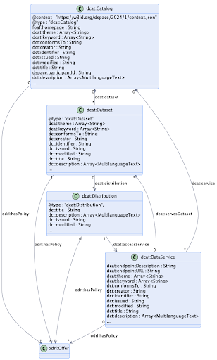
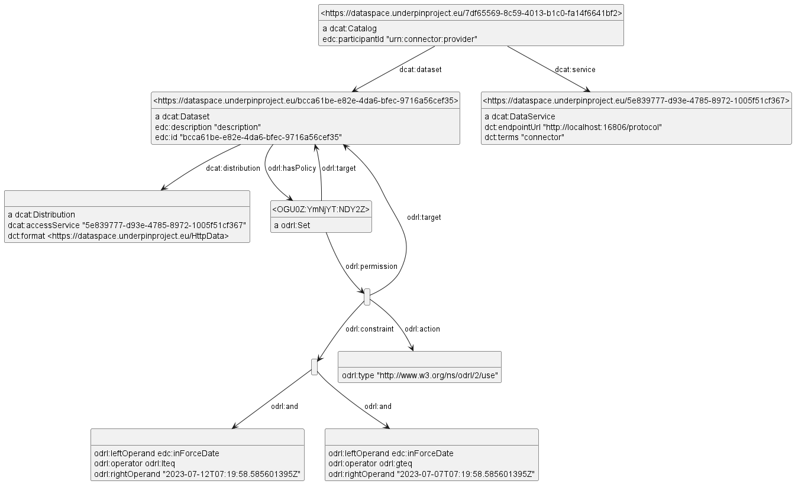

<!-- markdown-toc start - Don't edit this section. Run M-x markdown-toc-refresh-toc -->
**Table of Contents**

- [DCAT Info](#dcat-info)
    - [Example DCAT](#example-dcat)
- [Dataspace Catalog Response](#dataspace-catalog-response)
    - [Canned Response as JSON](#canned-response-as-json)
    - [Canned Response as Turtle](#canned-response-as-turtle)
    - [Canned Response Problems](#canned-response-problems)
    - [JSONLD With Context](#jsonld-with-context)
    - [Real Response as JSON](#real-response-as-json)
    - [Real Response as Turtle](#real-response-as-turtle)
    - [Real Response Problems](#real-response-problems)

<!-- markdown-toc end -->

# DCAT Info
The W3C [Dataset Catalog (DCAT) ontology](https://www.w3.org/TR/vocab-dcat-3/) is the prevalent ontology for dataset metadata.
It is well established: it is mature (has been in development since 2014 and the current version is 3) 
and is the foundation of numerous data portals and other data sharing initiatives, 
in particular the [European Data Portal](https://data.europa.eu/en). 
Various DCAT profiles have been created: 
for EU datasets (DCAT-AP), statistics ([StatDCAT-AP](https://interoperable-europe.ec.europa.eu/collection/semic-support-centre/solution/statdcat-application-profile-data-portals-europe)), geospatial ([GeoDCAT-AP](https://semiceu.github.io/GeoDCAT-AP/drafts/latest/)), life sciences ([HCLS Dataset](https://www.w3.org/TR/hcls-dataset/)), national (DE, NO, DK, SE, IT), 
Dataspaces, etc. 

DCAT information can be presented in many forms including RDF accessible via SPARQL endpoints, embedded in HTML pages as HTML-RDFa, or serialized as RDF/XML, N3, Turtle, JSON-LD.

Properties explanation:
- `@context` and `@type`: Define the context and type for the JSON-LD schema.
- name: The name of the dataset.
- description: A brief description of what the dataset contains.
- identifier: A unique identifier for the dataset.
- keywords: Keywords to help in searching for the dataset.
- license: The license under which the dataset is published.
- publisher: Information about the organization that published the dataset.
- distribution: Details about how the dataset can be accessed, including the file formats and URLs.
- temporalCoverage: The time period during which the data was collected.
- spatialCoverage: Geographic coordinates and name of the area where the data was collected.
- contactPoint: Contact information for inquiries about the dataset.
- dateModified: The last modified date of the dataset.
- datePublished: The publication date of the dataset.
- creator: The organization that created the dataset.
- conformsTo: Indicates the standard or specification to which the dataset conforms, in this case, ISO 19115-1:2014.
- issued: The date when the dataset was issued.
- provenance: Provides information about the history or origin of the dataset, describing its collection process.
- datasetTimeInterval: Specifies the time interval during which the data was collected, using start and end dates.
- spatialResolution: Describes the spatial resolution of the data, with a value and unit (kilometers).
- hasPart: Indicates that this dataset is composed of other related datasets, providing details about one such subset.

All properties are 88 and they are distributed between classes as follows:
- Catalog
  - homepage
  - themes
  - resource
  - dataset
  - service
  - catalog
  - catalog record
- Cataloged Resource
  - access rights
  - conforms to
  - contact point
  - creator
  - description
  - title
  - release date
  - update/modification date
  - language
  - publisher
  - identifier
  - theme/category
  - type/genre
  - relation
  - qualified relation
  - keyword/tag
  - landing page
  - qualified attribution
  - license
  - rights
  - has part
  - has policy
  - is referenced by
  - previous version
  - has version
  - current version
  - replaces
  - version
  - version notes
  - status
  - first
  - last
  - previous
- Catalog Record
  - title
  - description
  - listing date
  - update/modification date
  - primary topic
  - conforms to
- Dataset
  - distribution
  - frequency
  - in series
  - spatial/geographical coverage
  - spatial resolution
  - temporal coverage
  - temporal resolution
  - was generated by
- Dataset Series
- Distribution
  - title
  - description
  - release date
  - update/modification date
  - license
  - access rights
  - rights
  - has policy
  - access URL
  - access service
  - download URL
  - byte size
  - spatial resolution
  - temporal resolution
  - conforms to
  - media type
  - format
  - compression format
  - packaging format
  - checksum
- Data Service
  - endpoint URL
  - endpoint description
  - serves dataset
- Concept Scheme
- Concept
- Organization/Person
- Relationship
  - relation
  - had role
- Role
- Period of Time
  - start date
  - end date
  - beginning
  - end
- Location
  - geometry
  - bounding box
  - centroid
- Checksum
  - algorithm
  - checksum value


## Example DCAT
[underpin-dcat.jsonld](underpin-dcat.jsonld) and [underpin-dcat.ttl](underpin-dcat.ttl) are example Dataset (asset) records about a wind turbine dataset that are quite more informative.

# Dataspace Catalog Response

The [Dataspace Protocol Catalog Response](https://docs.internationaldataspaces.org/ids-knowledgebase/dataspace-protocol/catalog/catalog.protocol#id-3.1-ack-catalog) should be JSON-LD conforming to the DCAT and ODRL ontologies.
It uses a reduced version of DCAT as shown here:



## Canned Response as JSON
You can get an example (canned) EDC/Sovity dataspace catalog response from
https://edc-ce.docs.sovity.de/backend/what-is-the-management-api/openapi-specification/catalog .

Saved as [dataspace-catalog-orig.jsonld](dataspace-catalog-orig.jsonld):
```json
{
  "@id": "7df65569-8c59-4013-b1c0-fa14f6641bf2",
  "@type": "dcat:Catalog",
  "dcat:dataset": {
    "@id": "bcca61be-e82e-4da6-bfec-9716a56cef35",
    "@type": "dcat:Dataset",
    "odrl:hasPolicy": {
      "@id": "OGU0ZTMzMGMtODQ2ZS00ZWMxLThmOGQtNWQxNWM0NmI2NmY4:YmNjYTYxYmUtZTgyZS00ZGE2LWJmZWMtOTcxNmE1NmNlZjM1:NDY2ZTZhMmEtNjQ1Yy00ZGQ0LWFlZDktMjdjNGJkZTU4MDNj",
      "@type": "odrl:Set",
      "odrl:permission": {
        "odrl:target": "bcca61be-e82e-4da6-bfec-9716a56cef35",
        "odrl:action": {"odrl:type": "http://www.w3.org/ns/odrl/2/use"},
        "odrl:constraint": {
          "odrl:and": [
            {
              "odrl:leftOperand": "https://w3id.org/edc/v0.0.1/ns/inForceDate",
              "odrl:operator": {"@id": "odrl:gteq"},
              "odrl:rightOperand": "2023-07-07T07:19:58.585601395Z"
            },
            {
              "odrl:leftOperand": "https://w3id.org/edc/v0.0.1/ns/inForceDate",
              "odrl:operator": {"@id": "odrl:lteq"},
              "odrl:rightOperand": "2023-07-12T07:19:58.585601395Z"
            }
          ]
        }
      },
      "odrl:prohibition": [],
      "odrl:obligation": [],
      "odrl:target": "bcca61be-e82e-4da6-bfec-9716a56cef35"
    },
    "dcat:distribution": [
      {
        "@type": "dcat:Distribution",
        "dct:format": {"@id": "HttpData"},
        "dcat:accessService": "5e839777-d93e-4785-8972-1005f51cf367"
      }
    ],
    "edc:description": "description",
    "edc:id": "bcca61be-e82e-4da6-bfec-9716a56cef35"
  },
  "dcat:service": {
    "@id": "5e839777-d93e-4785-8972-1005f51cf367",
    "@type": "dcat:DataService",
    "dct:terms": "connector",
    "dct:endpointUrl": "http://localhost:16806/protocol"
  },
  "edc:participantId": "urn:connector:provider",
  "@context": {
    "dct": "https://purl.org/dc/terms/",
    "edc": "https://w3id.org/edc/v0.0.1/ns/",
    "dcat": "https://www.w3.org/ns/dcat/",
    "odrl": "http://www.w3.org/ns/odrl/2/",
    "dspace": "https://w3id.org/dspace/v0.8/"
  }
}
```

## Canned Response as Turtle
Let's convert the example to Turtle using Jena riot:
```
riot --formatted ttl dataspace-catalog-orig.jsonld  > dataspace-catalog-orig.ttl
```
We get an error (see below), and this data ([dataspace-catalog-orig.ttl](dataspace-catalog-orig.ttl)):
```ttl
<OGU0ZTMzMGMtODQ2ZS00ZWMxLThmOGQtNWQxNWM0NmI2NmY4:YmNjYTYxYmUtZTgyZS00ZGE2LWJmZWMtOTcxNmE1NmNlZjM1:NDY2ZTZhMmEtNjQ1Yy00ZGQ0LWFlZDktMjdjNGJkZTU4MDNj>
        a                odrl:Set;
        odrl:permission  [ odrl:action      [ odrl:type  "http://www.w3.org/ns/odrl/2/use" ];
                           odrl:constraint  [ odrl:and  [ odrl:leftOperand   "https://w3id.org/edc/v0.0.1/ns/inForceDate";
                                                          odrl:operator      odrl:lteq;
                                                          odrl:rightOperand  "2023-07-12T07:19:58.585601395Z"
                                                        ];
                                              odrl:and  [ odrl:leftOperand   "https://w3id.org/edc/v0.0.1/ns/inForceDate";
                                                          odrl:operator      odrl:gteq;
                                                          odrl:rightOperand  "2023-07-07T07:19:58.585601395Z"
                                                        ]
                                            ];
                           odrl:target      "bcca61be-e82e-4da6-bfec-9716a56cef35"
                         ];
        odrl:target      "bcca61be-e82e-4da6-bfec-9716a56cef35" .

<file:///D:/Onto/proj/underpin/model/dcat/5e839777-d93e-4785-8972-1005f51cf367>
        a                dcat:DataService;
        dct:endpointUrl  "http://localhost:16806/protocol";
        dct:terms        "connector" .

<file:///D:/Onto/proj/underpin/model/dcat/7df65569-8c59-4013-b1c0-fa14f6641bf2>
        a                  dcat:Catalog;
        edc:participantId  "urn:connector:provider";
        dcat:dataset       <file:///D:/Onto/proj/underpin/model/dcat/bcca61be-e82e-4da6-bfec-9716a56cef35>;
        dcat:service       <file:///D:/Onto/proj/underpin/model/dcat/5e839777-d93e-4785-8972-1005f51cf367> .

<file:///D:/Onto/proj/underpin/model/dcat/bcca61be-e82e-4da6-bfec-9716a56cef35>
        a                  dcat:Dataset;
        odrl:hasPolicy     <OGU0ZTMzMGMtODQ2ZS00ZWMxLThmOGQtNWQxNWM0NmI2NmY4:YmNjYTYxYmUtZTgyZS00ZGE2LWJmZWMtOTcxNmE1NmNlZjM1:NDY2ZTZhMmEtNjQ1Yy00ZGQ0LWFlZDktMjdjNGJkZTU4MDNj>;
        edc:description    "description";
        edc:id             "bcca61be-e82e-4da6-bfec-9716a56cef35";
        dcat:distribution  [ a                   dcat:Distribution;
                             dct:format          <file:///D:/Onto/proj/underpin/model/dcat/HttpData>;
                             dcat:accessService  "5e839777-d93e-4785-8972-1005f51cf367"
                           ] .
```
There are numerous problems in the RDF data due to JSON-LD problems described in the next section.

## Canned Response Problems
There are various defects in the EDC/Sovity canned response:
- Doesn't return the correct `content-type`: should be `application/ld+json` instead of `application/json`
- Doesn't import the "canonical" context specified in the Protocol, which is https://w3id.org/dspace/2024/1/context.json 
  (see the first line of the diagram in [Dataspace Protocol Catalog Response](https://docs.internationaldataspaces.org/ids-knowledgebase/dataspace-protocol/catalog/catalog.protocol#id-3.1-ack-catalog), and the example [catalog.json](https://github.com/International-Data-Spaces-Association/ids-specification/blob/main/catalog/message/example/catalog.json))

Includes a deficient and defective context:
```json
    "edc": "https://w3id.org/edc/v0.0.1/ns/",
    "dcat": "https://www.w3.org/ns/dcat/",
    "odrl": "http://www.w3.org/ns/odrl/2/",
    "dspace": "https://w3id.org/dspace/v0.8/"
```
- Uses wrong DCAT namespace. 
  As you can see in the [DCAT spec](https://www.w3.org/TR/vocab-dcat-3/#abstract), the namespace for DCAT terms is http://www.w3.org/ns/dcat# 
  (http not https, and trailing hash not slash)
- Uses obsolete `dspace:` namespace. The "canonical" context specifies https://w3id.org/dspace/2024/1/ (this is a minor problem since no `dspace:` terms are used)
- Doesn't specify a `@base` which means that all `@id` fields are incorrectly resolved to local file URLs (depending on the RDFization tool). 
  - Eg `<file:///D:/Onto/proj/underpin/model/dcat/5e839777-d93e-4785-8972-1005f51cf367>`
- Uses a bad URI for `odrl:Set`, so we get this error from `riot` (see command below). The error means that the part before `:` is taken to be a URI scheme (completely wrong)
```
Not advised IRI: <OGU0ZTMzMGMtODQ2ZS00ZWMxLThmOGQtNWQxNWM0NmI2NmY4:YmNjYTYxYmUtZTgyZS00ZGE2LWJmZWMtOTcxNmE1NmNlZjM1:NDY2ZTZhMmEtNjQ1Yy00ZGQ0LWFlZDktMjdjNGJkZTU4MDNj> 
Code: 11/LOWERCASE_PREFERRED in SCHEME: lowercase is preferred in this component
```
- Doesn't define the `@type` of properties:
  - This leads to a disconnected RDF graph:
    - `odrl:target "bcca61be-e82e-4da6-bfec-9716a56cef35"` is a string,
      so it doesn't point to the Dataset URI `<file:///D:/Onto/proj/underpin/model/dcat/bcca61be-e82e-4da6-bfec-9716a56cef35>`
    - `dcat:accessService "5e839777-d93e-4785-8972-1005f51cf367"` is a string,
      so it doesn't point to the DataService URI `<file:///D:/Onto/proj/underpin/model/dcat/5e839777-d93e-4785-8972-1005f51cf367>`
    - (Note: according to the [DCAT spec](https://www.w3.org/TR/vocab-dcat-3/#Property:distribution_access_url), `dcat:accessURL` (if present) should be equal to `dcat:accessService/dcat:endpointURL`)
  - `odrl:type, odrl:leftOperand, dct:endpointUrl, dcat:accessService` should be URLs instead of strings
  - `odrl:rightOperand` should have datatype `xsd:dateTimeStamp` instead of string

There are also instance data problems:
- `dct:format` should be a IANA registered MIME type. 
  Instead, it is declared `@id` and is a fake/free-text string (eg "HttpData"), leading to a non-sensical URL: <file:///D:/Onto/proj/underpin/model/dcat/HttpData>
- `dct:endpointUrl` is a non-existent property, should be `dcat:endpointURL`
- `dct:terms` is a non-existent property, don't know what was meant here

## JSONLD With Context
Now let's put a better context in the JSON file. 
We refer to the "canonical" context, define `@base` and leave only the `edc` prefix (remove the two wrong prefixes):
```json
  "@context": [
    "https://w3id.org/dspace/2024/1/context.json",
    {
      "@base": "https://dataspace.underpinproject.eu/",
      "edc": "https://w3id.org/edc/v0.0.1/ns/"
    }
  ]
```

Let's convert this [dataspace-catalog-with-context.jsonld](dataspace-catalog-with-context.jsonld) to [dataspace-catalog-with-context.ttl](dataspace-catalog-with-context.ttl).
Prefixes defined in the referenced context are lost in transit, so we capture them in `prefixes.ttl` and prepend them to get an easier to read output:
```
riot.bat -out ttl dataspace-catalog-with-context.jsonld | cat prefixes.ttl - | riot.bat -syntax ttl -formatted ttl > dataspace-catalog-with-context.ttl
```
We again get errors `Not advised IRI: ... Code: 11/LOWERCASE_PREFERRED in SCHEME: lowercase is preferred in this component` about the `odrl:Set` URI.

The result is a bit better:
```ttl
PREFIX dcat: <http://www.w3.org/ns/dcat#>
PREFIX dct:  <http://purl.org/dc/terms/>
PREFIX edc:  <https://w3id.org/edc/v0.0.1/ns/>
PREFIX odrl: <http://www.w3.org/ns/odrl/2/>

<https://dataspace.underpinproject.eu/bcca61be-e82e-4da6-bfec-9716a56cef35>
        a                  dcat:Dataset;
        dcat:distribution  [ a                   dcat:Distribution;
                             dct:format          <https://dataspace.underpinproject.eu/HttpData>;
                             dcat:accessService  "5e839777-d93e-4785-8972-1005f51cf367"
                           ];
        odrl:hasPolicy     <OGU0ZTMzMGMtODQ2ZS00ZWMxLThmOGQtNWQxNWM0NmI2NmY4:YmNjYTYxYmUtZTgyZS00ZGE2LWJmZWMtOTcxNmE1NmNlZjM1:NDY2ZTZhMmEtNjQ1Yy00ZGQ0LWFlZDktMjdjNGJkZTU4MDNj>;
        edc:description    "description";
        edc:id             "bcca61be-e82e-4da6-bfec-9716a56cef35" .

<https://dataspace.underpinproject.eu/7df65569-8c59-4013-b1c0-fa14f6641bf2>
        a                  dcat:Catalog;
        dcat:dataset       <https://dataspace.underpinproject.eu/bcca61be-e82e-4da6-bfec-9716a56cef35>;
        dcat:service       <https://dataspace.underpinproject.eu/5e839777-d93e-4785-8972-1005f51cf367>;
        edc:participantId  "urn:connector:provider" .

<https://dataspace.underpinproject.eu/5e839777-d93e-4785-8972-1005f51cf367>
        a                dcat:DataService;
        dct:endpointUrl  "http://localhost:16806/protocol";
        dct:terms        "connector" .

<OGU0ZTMzMGMtODQ2ZS00ZWMxLThmOGQtNWQxNWM0NmI2NmY4:YmNjYTYxYmUtZTgyZS00ZGE2LWJmZWMtOTcxNmE1NmNlZjM1:NDY2ZTZhMmEtNjQ1Yy00ZGQ0LWFlZDktMjdjNGJkZTU4MDNj>
        a                odrl:Set;
        odrl:permission  [ odrl:action      [ odrl:type  "http://www.w3.org/ns/odrl/2/use" ];
                           odrl:constraint  [ odrl:and  [ odrl:leftOperand   edc:inForceDate;
                                                          odrl:operator      odrl:lteq;
                                                          odrl:rightOperand  "2023-07-12T07:19:58.585601395Z"
                                                        ];
                                              odrl:and  [ odrl:leftOperand   edc:inForceDate;
                                                          odrl:operator      odrl:gteq;
                                                          odrl:rightOperand  "2023-07-07T07:19:58.585601395Z"
                                                        ]
                                            ];
                           odrl:target      <https://dataspace.underpinproject.eu/bcca61be-e82e-4da6-bfec-9716a56cef35>
                         ];
        odrl:target      <https://dataspace.underpinproject.eu/bcca61be-e82e-4da6-bfec-9716a56cef35> .
```

Let's visualize it using [rdfpuml](https://github.com/VladimirAlexiev/rdf2rml/blob/master/doc/rdfpuml.md) 
(in the modified file `dataspace-catalog-with-context1.ttl` we shorten the mad `odrl:Set` URL and specify that the `odrl:target` arrows should go up):



- It's a connected RDF graph, but `dcat:accessService` is still not a URL so it doesn't connect to `DataService`
- `odrl:type` is not URL
- `odrl:rightOperand` doesn't have the correct XSD type

## Real Response as JSON
[dataspace-catalog-realistic.jsonld](dataspace-catalog-realistic.jsonld) is a real response after registering a very simple Dataset.

```json
{
    "@id": "6920fc77-ea4e-49ae-8f73-035f72311b99",
    "@type": "dcat:Catalog",
    "dcat:dataset": {
        "@id": "12345",
        "@type": "dcat:Dataset",
        "odrl:hasPolicy": {
            "@id": "Y29udHJhY3RkZWZpbml0aW9uLTE=:MTIzNDU=:MDE5MzAxNWEtYTk0NC03N2RlLTgzYzYtODA5MmVkYzE0ODE3",
            "@type": "odrl:Set",
            "odrl:permission": {
                "odrl:target": "12345",
                "odrl:action": {"odrl:type": "USE"}
            },
            "odrl:prohibition": [],
            "odrl:obligation": [],
            "odrl:target": "12345"
        },
        "dcat:distribution": [],
        "http://purl.org/dc/terms/license": "https://creativecommons.org/licenses/by/4.0/",
        "http://www.w3.org/ns/dcat#keyword": ["keyword1", "keyword2"],
        "https://semantic.sovity.io/dcat-ext#httpDatasourceHintsProxyBody": "false",
        "https://semantic.sovity.io/dcat-ext#httpDatasourceHintsProxyPath": "false",
        "http://purl.org/dc/terms/language": "https://w3id.org/idsa/code/EN",
        "http://purl.org/dc/terms/description": "my test document",
        "https://semantic.sovity.io/dcat-ext#httpDatasourceHintsProxyMethod": "false",
        "http://purl.org/dc/terms/publisher": {"http://xmlns.com/foaf/0.1/homepage": "https://myorg.com/"},
        "http://www.w3.org/ns/dcat#version": "1.0",
        "http://purl.org/dc/terms/creator": {"http://xmlns.com/foaf/0.1/name": "My Org"},
        "http://www.w3.org/ns/dcat#landingPage": "https://mydepartment.myorg.com/my-offer",
        "http://purl.org/dc/terms/title": "test-document",
        "http://www.w3.org/ns/dcat#mediaType": "text/plain",
        "edc:id": "12345",
        "https://semantic.sovity.io/dcat-ext#httpDatasourceHintsProxyQueryParams": "false"
    },
    "dcat:service": {
        "@id": "e8deda0e-08ca-4d9d-b268-ce3975fd452e",
        "@type": "dcat:DataService",
        "dct:terms": "connector",
        "dct:endpointUrl": "http://edc:11003/api/dsp"
    },
    "edc:participantId": "my-edc",
    "@context": {
        "dct": "https://purl.org/dc/terms/",
        "edc": "https://w3id.org/edc/v0.0.1/ns/",
        "dcat": "https://www.w3.org/ns/dcat/",
        "odrl": "http://www.w3.org/ns/odrl/2/",
        "dspace": "https://w3id.org/dspace/v0.8/"
    }
}
```


## Real Response as Turtle
I collected all rigth and wrong prefixes to [prefixes.ttl](prefixes.ttl) in order to obtain a better looking result. After converting to Turtle:
```
riot.bat -out ttl dataspace-catalog-realistic.jsonld | cat prefixes.ttl - | riot.bat -syntax ttl -formatted ttl > dataspace-catalog-realistic.ttl
```
Here is the result:
```ttl
PREFIX dcat:       <https://www.w3.org/ns/dcat/>
PREFIX dcat-ext:   <https://semantic.sovity.io/dcat-ext#>
PREFIX dcat-right: <http://www.w3.org/ns/dcat#>
PREFIX dcat-wrong: <https://www.w3.org/ns/dcat/>
PREFIX dct:        <https://purl.org/dc/terms/>
PREFIX dct-right:  <http://purl.org/dc/terms/>
PREFIX dct-wrong:  <https://purl.org/dc/terms/>
PREFIX dspace:     <https://w3id.org/dspace/v0.8/>
PREFIX edc:        <https://w3id.org/edc/v0.0.1/ns/>
PREFIX foaf:       <http://xmlns.com/foaf/0.1/>
PREFIX odrl:       <http://www.w3.org/ns/odrl/2/>

<file:///d:/Onto/proj/underpin/model/dcat/e8deda0e-08ca-4d9d-b268-ce3975fd452e>
        a                      dcat:DataService;
        dct-wrong:endpointUrl  "http://edc:11003/api/dsp";
        dct-wrong:terms        "connector" .

<file:///d:/Onto/proj/underpin/model/dcat/dataspace-catalog-realistic.jsonld>
        a                odrl:Set;
        odrl:permission  [ odrl:action  [ odrl:type  "USE" ];
                           odrl:target  "12345"
                         ];
        odrl:target      "12345" .

<file:///d:/Onto/proj/underpin/model/dcat/6920fc77-ea4e-49ae-8f73-035f72311b99>
        a                  dcat:Catalog;
        edc:participantId  "my-edc";
        dcat:dataset       <file:///d:/Onto/proj/underpin/model/dcat/12345>;
        dcat:service       <file:///d:/Onto/proj/underpin/model/dcat/e8deda0e-08ca-4d9d-b268-ce3975fd452e> .

<file:///d:/Onto/proj/underpin/model/dcat/12345>
        a                       dcat:Dataset;
        dct-right:creator       [ foaf:name  "My Org" ];
        dct-right:description   "my test document";
        dct-right:language      "https://w3id.org/idsa/code/EN";
        dct-right:license       "https://creativecommons.org/licenses/by/4.0/";
        dct-right:publisher     [ foaf:homepage  "https://myorg.com/" ];
        dct-right:title         "test-document";
        dcat-right:keyword      "keyword1" , "keyword2";
        dcat-right:landingPage  "https://mydepartment.myorg.com/my-offer";
        dcat-right:mediaType    "text/plain";
        dcat-right:version      "1.0";
        odrl:hasPolicy          <file:///d:/Onto/proj/underpin/model/dcat/dataspace-catalog-realistic.jsonld>;
        dcat-ext:httpDatasourceHintsProxyBody "false";
        dcat-ext:httpDatasourceHintsProxyMethod "false";
        dcat-ext:httpDatasourceHintsProxyPath "false";
        dcat-ext:httpDatasourceHintsProxyQueryParams "false";
        edc:id                  "12345" .
```

## Real Response Problems
The real response has even more problems than the canned response:
- Lacks `dcat:Distribution` (maybe the way we tried to add it was wrong)
- Doesn't define or use prefixes for `foaf, dcat-ext, dct`
- Uses both prefixed URLs with wrong prefix, and full URLs, eg:
  - `dcat:Dataset, dcat:service` use wrong prefix, `http://www.w3.org/ns/dcat#keyword` is right but unshortened
  - `dct:terms` uses wrong prefix, `http://purl.org/dc/terms/license` is right but unshortened
- Doesn't define `@base` so relative URLs are resolved to "random" full URLs
- The  `@id` of `odrl:Set` uses bad chars, so it is unsuitable as URI. If you look at the Turtle above, it's discarded (so that node obtains only the random base URL)
- Uses a nested node `{"odrl:action": {"odrl:type": ...}}` but:
  - The [ODRL Information Model 2.2](https://w3c.github.io/poe/model/) doesn't define `odrl:type`
  - The [odrl.jsonld](https://www.w3.org/ns/odrl.jsonld) context doesn't define such term.
    It aliases `"type": "@type"` but that means `rdf:type` and not `odrl:type`
  - None of the "action" examples show such "type" subnode
- Uses a plain string "USE" as the value. But:
  - The [IDSA Contract JSON schema](https://eclipse-dataspace-protocol-base.github.io/DataspaceProtocol/2024-1/negotiation/message/schema/contract-schema.json#/definitions/Action) uses prefixed URLs, and one of the allowed values is `"odrl:use"`
  - The [odrl.jsonld](https://www.w3.org/ns/odrl.jsonld) context specifies that it's a URL (`@vocab` means that by default it's resolved in the vocabulary namespace):
```json
"action": {
  "@type": "@vocab",
  "@id": "odrl:action"
}
```
- `dct:endpointUrl` is a non-existent property, should be `dcat:endpointURL`
- `dct:terms` is a non-existent property, don't know what is meant here
- The following are not declared as URL properties: `odrl:target, dct:endpointUrl, dcat:landingPage, dct:license, dct:language`
  - In particular, `odrl:target` doesn't link to the `dcat:Dataset` node
  - I checked, https://w3id.org/idsa/code/EN resolves and returns the complete IDSA ontology where that code is defined
    (IDSA uses a single namespace for all kinds of codes)
- The `dcat-ext:httpDatasourceHintsProxy*` props carry the string "false" and lack the datatype `xsd:boolean`
