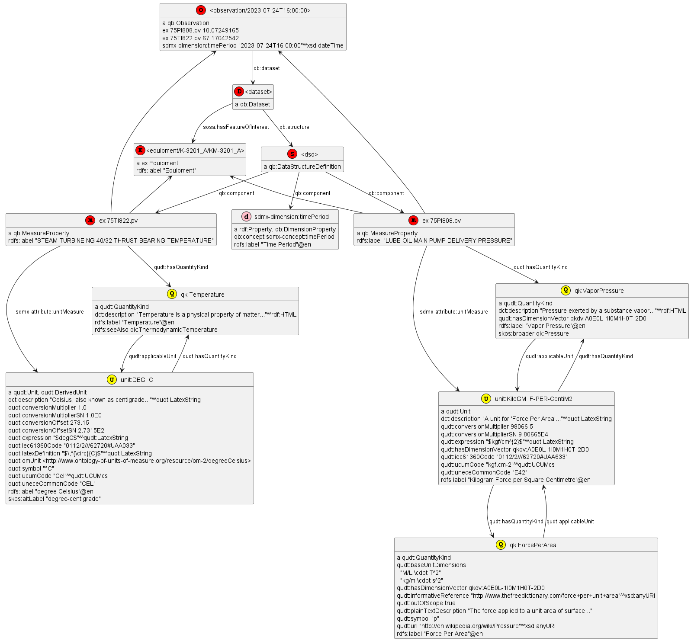

# Refinery Measurements Model

## Reused Ontologies

This is a sample model of refinery-related measurements.
Reused ontologies:
- W3C Cube (QB) for statistical Observations, including Data Structure Definitions and Datasets
- SDMX for definitions of standard props, such as `timePeriod`
- QUDT for rich definitions of `Units, QuantityKinds` and links to external UoM vocabularies
- SOSA for describing the equipment (`hasFeatureOfInterest`) that sensor readings are about 
 
Note: the current thinking is to store observations in a time-series database (Influx) 
and use CSVW to describe them,
instead of storing them in RDF by using the CUBE ontology.

## Model

Diagram generated from [refinery-cube.ttl](refinery-cube.ttl):

Legend:
- red: project-specific data
- pink: definitions reused from SDMX
- yellow: definitions reused from QUDT

Overview:
- The `Observation` carries all project-specific measurements (`MeasureProperty`),
  and a standard timestamp prop `timePeriod` (which is `DimensionProperty`)
- The `Dataset` holds observations having the same structure,
  and points
- The `DataStructureDefinition` defines what props are expected in each observation
- Each `MeasureProperty` specifies what it is (`QuantityKind`)
  and what `unitMeasure` it uses (`Unit`),
  leveraging a standard ontology.

## Links

- [Data samples](https://motoroil.sharepoint.com/:f:/r/sites/UNDERPIN/Shared%20Documents/General/2.%20WPs/WP4-Use-cases/01.%20Data%20samples/01.%20Refinery%20data?csf=1&web=1&e=fdrc2L) on the project's Teams drive.

## Quantity Kinds

Categories are mapped to [qudt:QuantityKind](https://www.qudt.org/doc/DOC_VOCAB-QUANTITY-KINDS.html)

| value               | qudt:QuantityKind            | comment                                                        |
|---------------------|------------------------------|----------------------------------------------------------------|
| AXIAL DISPLACEMENT  | ???                          |                                                                |
| CURRENT             | quantitykind:TotalCurrent    |                                                                |
| FLOW                | quantitykind:MassFlowRate    |                                                                |
| PRESSURE            | quantitykind:DynamicPressure |                                                                |
| speed               |                              | this is actually turbine rotation  `quantitykind:Speed` is NOK |
| TEMPERATURE         | quantitykind:Temperature     |                                                                |
| VIBRATION           | ??                           |                                                                |

## Units

Units of Measure are mapped to [qudt:Unit](https://www.qudt.org/doc/DOC_VOCAB-UNITS.html)

| value   | qudt:Unit                   | comment                             |
|---------|-----------------------------|-------------------------------------|
| Ampere  | unit:A                      |                                     |
| degC    | unit:DEG_C                  |                                     |
| Kg/cm2  | unit:KiloGM_F-PER-CentiM2   | also present in lowercasec (kg/cm2) |
| Kgf/cm2 | unit:KiloGM_F-M-PER-CentiM2 |                                     |
| Kg/h    | unit:KiloGM-PER-HR          |                                     |
| micron  | unit:MicroM                 |                                     |
| mm      | unit:MilliM                 |                                     |
| rpm     | unit:REV-PER-MIN            |                                     |

## Questions

- How to model thresholds ?
- How to model aggregation rules?
- Equipment ids consist of two parts that are often redundant. Not sure what's going on there. Examples:
  - redundant: `K-2201/KT-2201`
  - redundant: `K-3301 B/KT-3301 B`
  - not redundant: `K-7502/ST-7501`
