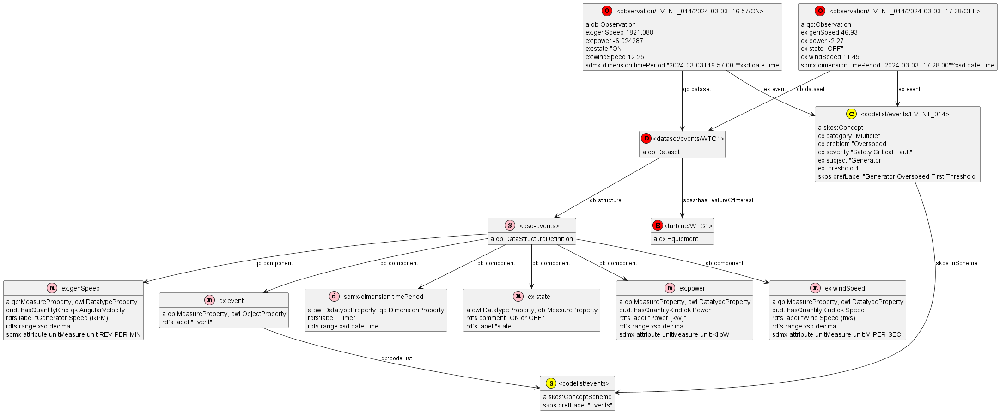

# Wind Farm Data Model

This model describes a semantic mapping for some wind turbine data sources.
Links to sample data are on google drive.

## Sensor Data as CSVW
CSW on the Web (CSVW) is a W3C standard for describing CSV sheets in a machine-readable way.

Resources (all W3C specs are Editor's Draft 02 November 2022 unless otherwise indicated):
- https://csvw.org/: This site explains CSVW and suggests tools one can use for working with it
- https://w3c.github.io/csvw/primer: CSV on the Web: A Primer
- https://w3c.github.io/csvw/metadata/: Metadata Vocabulary for Tabular Data
- https://www.rfc-editor.org/rfc/rfc6570: URL Templates as used in CSVW
- https://w3c.github.io/csvw/syntax/: Model for Tabular Data and Metadata on the Web
- https://w3c.github.io/csvw/csv2rdf/: Generating RDF from Tabular Data on the Web
- https://w3c.github.io/csvw/ns/: CSVW Namespace Vocabulary Terms (06 June 2017)

### Important Columns

We describe the important (yellow) columns in [Data importance.xlsx](https://docs.google.com/spreadsheets/d/1bcJzVmA8zkub2kN7XCoMX-AQ1JCvMlgK/edit?usp=drive_link&ouid=104921038219224672281&rtpof=true&sd=true)
- We assume that the dataspace will serve CSVs with columns named in the same way
- Not all columns need to be described semantically: only the important columns, and only these are ingested to a time-series database
- The "yellow" columns included a column number in parentheses, which is not present in the data so we moved it to the col `n`
- We also describe two "global" columns (the first two), not present in that "yellow" sheet but present eg in [WF2_WTG03 - Row Data.xlsx](https://docs.google.com/spreadsheets/d/15ynrLexf3nYb8E_8esOBCr9WTx2D2VbS/edit)
- The `unit` was not mentioned in the yellow columns, but we guessed it from

|   n | column                                      | quantity, unit or example  | comment                                                                                            |
|-----|---------------------------------------------|----------------------------|----------------------------------------------------------------------------------------------------|
|     | System Name                                 | "WTG-03"                   | Filled only in the first row, and mentions only the generator but not the farm, i.e. is incomplete |
|     | Time Stamp                                  | "1/1/2023 12:00:00 AM"     | Not in XSD (*) format                                                                              |
|   1 | Generator Bearing2 Temp. Avg.               | qk:Temperature, unit:DEG_C |                                                                                                    |
|   2 | Generator Bearing Temp. Avg.                | qk:Temperature, unit:DEG_C |                                                                                                    |
|  13 | Gear Bearing TemperatureHSGeneratorEnd Avg. | qk:Temperature, unit:DEG_C |                                                                                                    |
|  14 | Gear Bearing TemperatureHSMiddle Avg.       | qk:Temperature, unit:DEG_C |                                                                                                    |
|  15 | Gear Bearing TemperatureHSRotorEnd Avg.     | qk:Temperature, unit:DEG_C |                                                                                                    |
|  18 | Gear Bearing Temp. Avg.                     | qk:Temperature, unit:DEG_C |                                                                                                    |
|  19 | Gear Oil TemperatureBasis Avg.              | qk:Temperature, unit:DEG_C |                                                                                                    |
|  20 | Gear Oil TemperatureLevel1 Avg.             | qk:Temperature, unit:DEG_C |                                                                                                    |
|  21 | Gear Oil TemperatureLevel2_3 Avg.           | qk:Temperature, unit:DEG_C |                                                                                                    |
|  22 | Gear Oil Temp. Avg.                         | qk:Temperature, unit:DEG_C |                                                                                                    |
|  33 | Ambient WindSpeed Avg.                      | qk:Temperature, unit:DEG_C |                                                                                                    |
|  34 | Ambient WindSpeed Max.                      | qk:Temperature, unit:DEG_C |                                                                                                    |
|  35 | Ambient WindSpeed Min.                      | qk:Temperature, unit:DEG_C |                                                                                                    |
|  88 | HVTrafo Phase1 Temp. Avg.                   | qk:Temperature, unit:DEG_C |                                                                                                    |
|  89 | HVTrafo Phase2 Temp. Avg.                   | qk:Temperature, unit:DEG_C |                                                                                                    |
|  90 | HVTrafo Phase3 Temp. Avg.                   | qk:Temperature, unit:DEG_C |                                                                                                    |
| 126 | Total Active power                          | qk:ActivePower, unit:KiloW |                                                                                                    |

(*) To specify the dateTime format, we use this:
`"datatype": {"base": "dateTime", "format": "M/d/yyyy HH:mm:ss"}`.
But I don't how we can specify AM/PM indicator:
[Primer 3.8 How do you validate dates that aren't in standard date or time formats?](https://w3c.github.io/csvw/primer/#date-format)
doesn't show such example and states
"Implementations are only required to understand a particular set of common formats for dates and times".

### CSVW Manifest

We make a CSVW Manifest as follows.
We first start by importing the CSVW context, specifying the metadata language, and defining a prefix for property definitions:
```json
  "@context": [
    "http://www.w3.org/ns/csvw", {
      "@language": "en",
      "un": "https://dataspace.underpinproject.eu/ontology/"
    }],
```

Then we describe URLs:
```json
  "tables": [{
    "url": "https://dataspace.underpinproject.eu/csv/wind-farm/sensor-data-01/WF2/WTG03/2023-01-01",
    "tableSchema": {
      "aboutUrl": "#{Time_Stamp}",
      "propertyUrl": "un:{_name}",
```
- the CSV overall
- the URL of every row (`aboutUrl`)
- a mapping for the URL of every column (`propertyUrl`).
  TODO: I've only seen examples of `propertyUrl` used inside `columns`.
  However, the [CSVW Namespace](https://w3c.github.io/csvw/ns/) allows this prop to be applied to `csvw:Schema`, so hopefully it will work when used at the `tableSchema` level.

Then we describe each column:
```json
      "columns": [
        {"titles": "System Name",                                 "name": "System_Name",                                "datatype": "string"},
        {"titles": "Time Stamp",                                  "name": "Time_Stamp",                                 "datatype": {"base": "dateTime", "format": "M/d/yyyy HH:mm:ss"}},
        {"titles": "Generator Bearing2 Temp. Avg.",               "name": "Generator_Bearing2_Temp_Avg",                "datatype": "decimal"},
        {"titles": "Generator Bearing Temp. Avg.",                "name": "Generator_Bearing_Temp_Avg",                 "datatype": "decimal"},
        {"titles": "Gear Bearing TemperatureHSGeneratorEnd Avg.", "name": "Gear_Bearing_TemperatureHSGeneratorEnd_Avg", "datatype": "decimal"},
        {"titles": "Gear Bearing TemperatureHSMiddle Avg.",       "name": "Gear_Bearing_TemperatureHSMiddle_Avg",       "datatype": "decimal"},
        {"titles": "Gear Bearing TemperatureHSRotorEnd Avg.",     "name": "Gear_Bearing_TemperatureHSRotorEnd_Avg",     "datatype": "decimal"},
        {"titles": "Gear Bearing Temp. Avg.",                     "name": "Gear_Bearing_Temp_Avg",                      "datatype": "decimal"},
        {"titles": "Gear Oil TemperatureBasis Avg.",              "name": "Gear_Oil_TemperatureBasis_Avg",              "datatype": "decimal"},
        {"titles": "Gear Oil TemperatureLevel1 Avg.",             "name": "Gear_Oil_TemperatureLevel1_Avg",             "datatype": "decimal"},
        {"titles": "Gear Oil TemperatureLevel2_3 Avg.",           "name": "Gear_Oil_TemperatureLevel2_3_Avg",           "datatype": "decimal"},
        {"titles": "Gear Oil Temp. Avg.",                         "name": "Gear_Oil_Temp_Avg",                          "datatype": "decimal"},
        {"titles": "Ambient WindSpeed Avg.",                      "name": "Ambient_WindSpeed_Avg",                      "datatype": "decimal"},
        {"titles": "Ambient WindSpeed Max.",                      "name": "Ambient_WindSpeed_Max",                      "datatype": "decimal"},
        {"titles": "Ambient WindSpeed Min.",                      "name": "Ambient_WindSpeed_Min",                      "datatype": "decimal"},
        {"titles": "HVTrafo Phase1 Temp. Avg.",                   "name": "HVTrafo_Phase1_Temp_Avg",                    "datatype": "decimal"},
        {"titles": "HVTrafo Phase2 Temp. Avg.",                   "name": "HVTrafo_Phase2_Temp_Avg",                    "datatype": "decimal"},
        {"titles": "HVTrafo Phase3 Temp. Avg.",                   "name": "HVTrafo_Phase3_Temp_Avg",                    "datatype": "decimal"},
        {"titles": "Total Active power",                          "name": "Total_Active_power",                         "datatype": "decimal"}
      ]
```
- `title` as originally given (with spaces and dots); there can be multiple column titles, but we use only one
- `name` converted to an "identifier' form
- `datatype`, which can be a XSD primitive, or a derived datatype with `format` or other facets

TODO: we also need to specify which columns to ignore (the unimportant ones).

If we convert this JSON to Turtle, we get this representation.
It consists of blank nodes, whose types are left implicit (they are `csvw:Table, csvw:Schema, csvw:Column` respectively)

```ttl
@prefix csvw: <http://www.w3.org/ns/csvw#> .
@prefix un:   <https://dataspace.underpinproject.eu/ontology/> .
@prefix xsd:  <http://www.w3.org/2001/XMLSchema#> .

[ csvw:table
  csvw:url "https://dataspace.underpinproject.eu/csv/wind-farm/sensor-data-01/WF2/WTG03/2023-01-01"^^xsd:anyURI;
  [ csvw:tableSchema
    [ csvw:aboutUrl     "#{Time_Stamp}"^^csvw:uriTemplate ;
      csvw:propertyUrl  "un:{_name}"^^csvw:uriTemplate ;
      csvw:column ( 
        [ csvw:title "System Name"@en                  ; csvw:name "System_Name"                ; csvw:datatype  xsd:string                                               ]
        [ csvw:title "Time Stamp"@en                   ; csvw:name "Time_Stamp"                 ; csvw:datatype  [ csvw:base "dateTime"; csvw:format "M/d/yyyy HH:mm:ss"] ]
        [ csvw:title "Generator Bearing2 Temp. Avg."@en; csvw:name "Generator_Bearing2_Temp_Avg"; csvw:datatype  xsd:decimal                                              ]
     )
] .
```

### UNDERPIN Property Definitions

We define the important columns of each CSV as RDF property definitions.
- We break down the property name into distinct components allowing a user to find all "temperature" props, or all props relating to "bearings", etc
- We repeat the CSVW `datatype` as `rdfs:range`
- We specify the W3C Cube nature of each property (`qb:MeasureProperty` vs `qb:DimensionProperty`)
- We don't specify `domain` because to want the props to apply to both `csvw:Row, qb:Observation`
- TODO: specify characteristics (column annotations) for Influx ingestion

```ttl
un:System_Name a owl:DatatypeProperty, qb:DimensionProperty; rdfs:label "System Name"@en;
  rdfs:range xsd:string; .
un:Time_Stamp a owl:DatatypeProperty, qb:DimensionProperty; rdfs:label "Time Stamp"@en;
  rdfs:range xsd:dateTime; .
un:Generator_Bearing2_Temp_Avg a owl:DatatypeProperty, qb:MeasureProperty; rdfs:label "Generator Bearing2 Temp. Avg."@en;
  rdfs:range xsd:decimal; qudt:unit unit:DEG_C; qudt:hasQuantityKind qk:Temperature; sosa:hasFeatureOfInterest "Generator"; un:part "Bearing"; un:partQualifier "2"; un:qualifier "average".
un:Generator_Bearing_Temp_Avg a owl:DatatypeProperty, qb:MeasureProperty; rdfs:label "Generator Bearing Temp. Avg."@en;
  rdfs:range xsd:decimal; qudt:unit unit:DEG_C; qudt:hasQuantityKind qk:Temperature; sosa:hasFeatureOfInterest "Generator"; un:part "Bearing"; un:qualifier "average".
un:Gear_Bearing_TemperatureHSGeneratorEnd_Avg a owl:DatatypeProperty, qb:MeasureProperty; rdfs:label "Gear Bearing TemperatureHSGeneratorEnd Avg."@en;
  rdfs:range xsd:decimal; qudt:unit unit:DEG_C; qudt:hasQuantityKind qk:Temperature; sosa:hasFeatureOfInterest "Gear"; un:part "Bearing"; un:partQualifier "HSGeneratorEnd"; un:qualifier "average".
un:Gear_Bearing_TemperatureHSMiddle_Avg a owl:DatatypeProperty, qb:MeasureProperty; rdfs:label "Gear Bearing TemperatureHSMiddle Avg."@en;
  rdfs:range xsd:decimal; qudt:unit unit:DEG_C; qudt:hasQuantityKind qk:Temperature; sosa:hasFeatureOfInterest "Gear"; un:part "Bearing"; un:partQualifier "HSMiddle"; un:qualifier "average".
un:Gear_Bearing_TemperatureHSRotorEnd_Avg a owl:DatatypeProperty, qb:MeasureProperty; rdfs:label "Gear Bearing TemperatureHSRotorEnd Avg."@en;
  rdfs:range xsd:decimal; qudt:unit unit:DEG_C; qudt:hasQuantityKind qk:Temperature; sosa:hasFeatureOfInterest "Gear"; un:part "Bearing"; un:partQualifier "HSRotorEnd"; un:qualifier "average".
un:Gear_Bearing_Temp_Avg a owl:DatatypeProperty, qb:MeasureProperty; rdfs:label "Gear Bearing Temp. Avg."@en;
  rdfs:range xsd:decimal; qudt:unit unit:DEG_C; qudt:hasQuantityKind qk:Temperature; sosa:hasFeatureOfInterest "Gear"; un:part "Bearing"; un:qualifier "average".
un:Gear_Oil_TemperatureBasis_Avg a owl:DatatypeProperty, qb:MeasureProperty; rdfs:label "Gear Oil TemperatureBasis Avg."@en;
  rdfs:range xsd:decimal; qudt:unit unit:DEG_C; qudt:hasQuantityKind qk:Temperature; sosa:hasFeatureOfInterest "Gear"; un:part "Oil"; un:partQualifier "Basis"; un:qualifier "average".
un:Gear_Oil_TemperatureLevel1_Avg a owl:DatatypeProperty, qb:MeasureProperty; rdfs:label "Gear Oil TemperatureLevel1 Avg."@en;
  rdfs:range xsd:decimal; qudt:unit unit:DEG_C; qudt:hasQuantityKind qk:Temperature; sosa:hasFeatureOfInterest "Gear"; un:part "Oil"; un:partQualifier "Level1"; un:qualifier "average".
un:Gear_Oil_TemperatureLevel2_3_Avg a owl:DatatypeProperty, qb:MeasureProperty; rdfs:label "Gear Oil TemperatureLevel2_3 Avg."@en;
  rdfs:range xsd:decimal; qudt:unit unit:DEG_C; qudt:hasQuantityKind qk:Temperature; sosa:hasFeatureOfInterest "Gear"; un:part "Oil"; un:partQualifier "Level2_3"; un:qualifier "average".
un:Gear_Oil_Temp_Avg a owl:DatatypeProperty, qb:MeasureProperty; rdfs:label "Gear Oil Temp. Avg."@en;
  rdfs:range xsd:decimal; qudt:unit unit:DEG_C; qudt:hasQuantityKind qk:Temperature; sosa:hasFeatureOfInterest "Gear"; un:part "Oil"; un:qualifier "average".
un:Ambient_WindSpeed_Avg a owl:DatatypeProperty, qb:MeasureProperty; rdfs:label "Ambient WindSpeed Avg."@en;
  rdfs:range xsd:decimal; qudt:unit unit:M-PER-SEC; qudt:hasQuantityKind qk:LinearVelocity; sosa:hasFeatureOfInterest "Wind"; un:qualifier "average".
un:Ambient_WindSpeed_Max a owl:DatatypeProperty, qb:MeasureProperty; rdfs:label "Ambient WindSpeed Max."@en;
  rdfs:range xsd:decimal; qudt:unit unit:M-PER-SEC; qudt:hasQuantityKind qk:LinearVelocity; sosa:hasFeatureOfInterest "Wind"; un:qualifier "maximum".
un:Ambient_WindSpeed_Min a owl:DatatypeProperty, qb:MeasureProperty; rdfs:label "Ambient WindSpeed Min."@en;
  rdfs:range xsd:decimal; qudt:unit unit:M-PER-SEC; qudt:hasQuantityKind qk:LinearVelocity; sosa:hasFeatureOfInterest "Wind"; un:qualifier "minimim".
un:HVTrafo_Phase1_Temp_Avg a owl:DatatypeProperty, qb:MeasureProperty; rdfs:label "HVTrafo Phase1 Temp. Avg."@en;
  rdfs:range xsd:decimal; qudt:unit unit:DEG_C; qudt:hasQuantityKind qk:Temperature; sosa:hasFeatureOfInterest "HVTrafo"; un:part "Phase"; un:partQualifier "1"; un:qualifier "average".
un:HVTrafo_Phase2_Temp_Avg a owl:DatatypeProperty, qb:MeasureProperty; rdfs:label "HVTrafo Phase2 Temp. Avg."@en;
  rdfs:range xsd:decimal; qudt:unit unit:DEG_C; qudt:hasQuantityKind qk:Temperature; sosa:hasFeatureOfInterest "HVTrafo"; un:part "Phase"; un:partQualifier "2"; un:qualifier "average".
un:HVTrafo_Phase3_Temp_Avg a owl:DatatypeProperty, qb:MeasureProperty; rdfs:label "HVTrafo Phase3 Temp. Avg."@en;
  rdfs:range xsd:decimal; qudt:unit unit:DEG_C; qudt:hasQuantityKind qk:Temperature; sosa:hasFeatureOfInterest "HVTrafo"; un:part "Phase"; un:partQualifier "3"; un:qualifier "average".
un:Total_Active_power a owl:DatatypeProperty, qb:MeasureProperty; rdfs:label "Total Active power"@en;
  rdfs:range xsd:decimal; qudt:unit unit:KiloW; qudt:hasQuantityKind qk:ActivePower; sosa:hasFeatureOfInterest "Generator".
```

### CSV and CSVW Manifest URLs (Locations)

Let's discuss the URLs (locations) from which CSV and CSVW will be served.

What URLs will the dataspace use to serve CSV files (of course, properly protected to require authentication and contract signing)?
Let's assume a pattern like this:
https://dataspace.underpinproject.eu/csv/wind-farm/sensor-data-01#WF2-WTG03-2023-01-01
where:
- `sensor-data-01` indicates one kind of wind farm sensor data (there may be any number)
- `WF2-WTG03` indicates Wind Farm 2 and Wind Turbine Generator 03
- `2023-01-01` indicates the date (or start of time period). If the slice covers a whole month, it's better to use `2023-01`
- We put the farm, generator and date in a fragment (after `#`) to be able to use one Manifest for many CSVs, see below

How to use one CSVW Manifest to describe many homogeneous tables (eg the monthly slices of some time series)?
- The PoolParty UI can use a template and have a "copy" operation to replicate a CSVW description,
  allowing the user to edit the specifics (farm, generator and date), eg in table [notes](https://w3c.github.io/csvw/syntax/#dfn-table-notes) or in separate metadata fields.
- [Metadata 5.3 Table Groups](https://w3c.github.io/csvw/metadata/#table-groups) applies to heterogeneous tables, i.e. each has its own description
- [Syntax 5.3 Default Locations and Site-wide Location Configuration](https://w3c.github.io/csvw/syntax/#default-locations-and-site-wide-location-configuration) allows to specify the location of CSV Manifests
  by using URL templates in the file https://dataspace.underpinproject.eu/.well-known/csvm
  - Eg if we used `https://dataspace.underpinproject.eu/csvm-global.json`,
    then that global JSON will be used for all CSV served by the dataspace.
  - However, we'll have several different kinds of CSV.
    We can use this feature: "Expand the URI template, with the variable url being set to the URL of the requested tabular data file (with **any fragment component of that URL removed**).
    A default template is `{+url}-metadata.json`, so it's enough to serve the CSVW Manifest from
    `https://dataspace.underpinproject.eu/csv/wind-farm/sensor-data-01-metadata.json`

Unfortunately, using a fragment in the CSV URL (`wind-farm/sensor-data-01#WF2-WTG03-2023-01-01`)
makes it harder to specify the subject ([aboutUrl](https://w3c.github.io/csvw/metadata/#cell-aboutUrl)) of each row
because we cannot use a relative URL, nor a second fragment.
- We can use a row URL like
  `wind-farm/sensor-data-01#WF2-WTG03-2023-01-01T01:23:45`
  or `wind-farm/sensor-data-01#WF2-WTG03-2023-01-01-row3`
  but we have to specify this with an absolute URL, which defeats the desire to use one CSVW Manifest for many tables
- URL Templates [3.2. Expression Expansion](https://www.rfc-editor.org/rfc/rfc6570#section-3.2) shows that numerous delimiters can be used,
  so maybe we can work around this problem?
- If we give up on the use of fragment for the CSV URL,
  - Then we can specify  `"aboutUrl": "#{Time_Stamp}"`
  - And if the CSV URL is `wind-farm/sensor-data-01/WF2/WTG03/2023-01-01`
  - Then row URLs will end up like `wind-farm/sensor-data-01/WF2/WTG03/2023-01-01#2023-01-01T01:23:45`

Hopefully, we can use global `tableSchema` definitions and access them by URL,
eg `https://dataspace.underpinproject.eu/csv/wind-farm/sensor-data-01-schema`.
[Example 8](https://w3c.github.io/csvw/syntax/#example-8-metadata-file-referencing-multiple-tabular-data-files-sharing-a-schema) "Metadata file referencing multiple tabular data files sharing a schema"
shows a somewhat similar example.

## Alert Events as Cube
[Event Logs - Case 1](https://docs.google.com/spreadsheets/d/1ebEnlE-B7WI8Gzfc-fV6vvkmZ8GAu4K1)
Contains alert events.
They have a similar structure like logs, but use different identifiers and categories.

| System | Timestamp    | Status | Name      | Description                         | Category | Event Type            | Power (kW) | Wind Speed (m/s) | Gen. Speed (Rpm) | CCU Event |
|--------|--------------|--------|-----------|-------------------------------------|----------|-----------------------|------------|------------------|------------------|-----------|
| WTG1   | 3/3/22 16:57 | ON     | EVENT_014 | Generator Overspeed First Threshold | Multiple | Safety Critical fault |      -6.02 |            12.25 |          1821.09 | No        |
| WTG1   | 3/3/22 17:28 | OFF    | EVENT_014 | Generator Overspeed First Threshold | Multiple | Safety Critical fault |      -2.27 |            11.49 |            46.93 | No        |

This model uses the [W3C Cube ontology](https://www.w3.org/TR/vocab-data-cube/) to represent timeseries directly in RDF.
- Please note that this is not the final version.
- The current thinking is to use a timeseries database and only keep semantic description

### Cube Model

Diagram generated from [wt-events.ttl](wt-events.ttl):



Legend:
- red: project-specific readings
- pink: W3C CUBE definitions: `DataStructureDefinition` and properties
- yellow: thesauri (`ConceptSchemes`) and nomenclature values (`Concept`)

Overview:
- The `Observation` carries all project-specific measurements (`MeasureProperty`),
  and a standard timestamp prop `timePeriod` (which is `DimensionProperty`)
- The `Dataset` holds observations having the same structure,
  and points to the equipment being observed (`hasFeatureOfInterest`)
- The `DataStructureDefinition` defines what props are expected in each observation
- Numeric `MeasureProperties` specify what it is (`QuantityKind`)
  and what `unitMeasure` it uses (`Unit`),
  leveraging a standard ontology.
- Conceptual `MeasureProperties` (`event`) specify concepts from which `ConceptScheme` they use as values
  (in this case an enumeration of events)


### Cube Fixes

- Defined a `@base`
- Removed empty prefix `:`
- Sorted and aligned prefixes
- Fixed `genSpeed` description
- Fixed "seconds" in timestamps to "00" as I think that's more natural than "59"
- Removed the "parasitic" last part ("seconds") from URLs ("59" or "00") since it's not in the data
- Consistently used 2 spaces to indent
- Put all props in a single namespace rather than subnamespaces like `<dim/power>`
- Renamed `<eventType>` to `severity` because that reflects better its nature.
- Parsed event names to capture their nature in a semantic way.
  Examples of props that can be extracted:
  - "Generator Overspeed First Threshold"
    - Subject (equipment/component): Generator (TODO: relate to Wind Farm ontology)
    - Problem: Overspeed
    - Threshold: 1
  - "Battery charging voltage not OK Axis3"
    - Subject (equipment/component): Battery
    - Property: charging voltage
    - Axis: 3 (TODO: what is this?)
    - (Problem "not OK" is generic, so not captured)
  - "Malfunction Triplepitch System Axis 3"
    - Subject (equipment/component): Triplepitch System
    - Axis: 3
    - (Problem "Malfunction" is generic, so not captured)

### Cube Questions

Clarifications and fixes needed:

- Maybe we need to remodel this as Events rather than Observations,
  because I think the table captures two parallel streams of info:
  alarm events (primary), and important background variables (power, wind speed, generator speed)
- Understand what is `<category>` ("multiple"??)
- Turn `subject, category, severity, problem` into thesauri rather than strings
- What is "Opened Safety Chain"? Appears in many events

## Sensor Data
[WF1_WGT01 - Row Data_Logs.xlsx](https://docs.google.com/spreadsheets/d/1bKZlcDIDZLF6biRiPdkgMAIKOaVn1PuO/) contains data from one turbine
- sheet `data` has raw time series data from 132 sensors
- sheet `logs` has log entries
